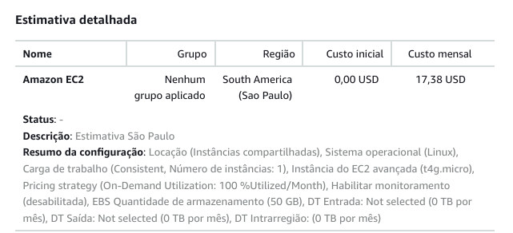
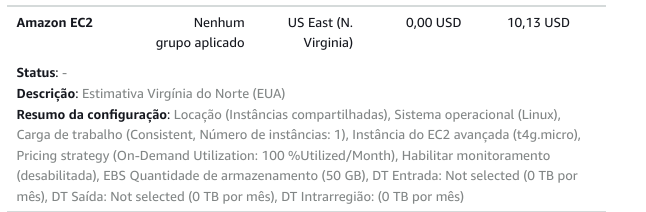
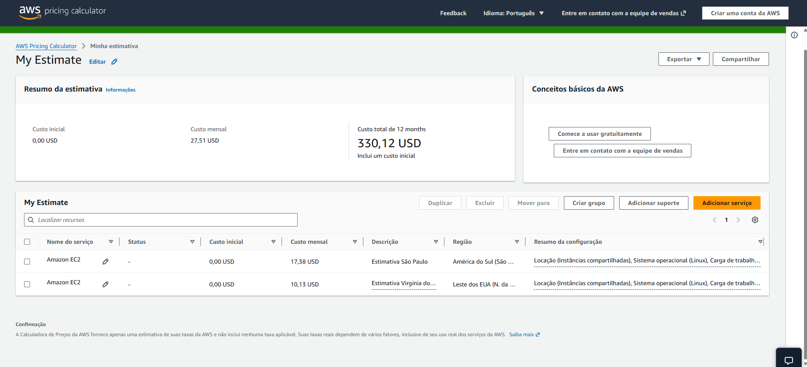
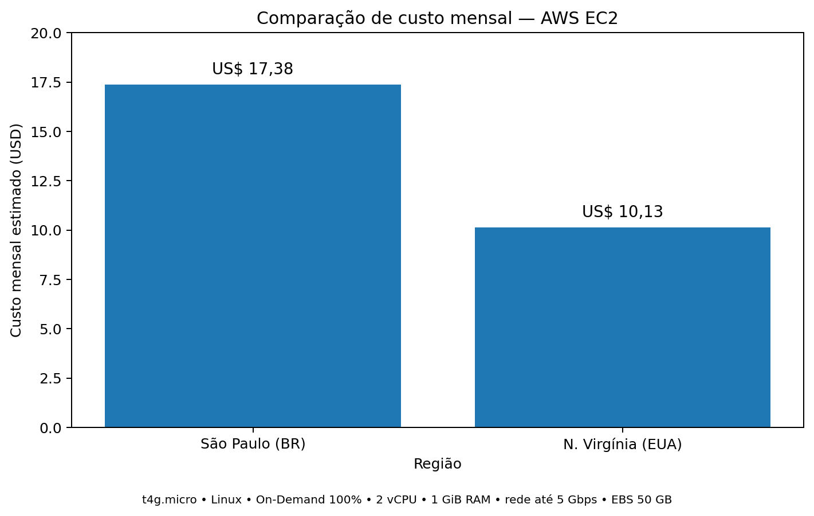

# FIAP - Faculdade de Informática e Administração Paulista

  

 

# FarmTech Solutions — Previsão de Rendimento de Safra + Computação em Nuvem (Fase 5)

Projeto desenvolvido para a FarmTech Solutions: previsão de rendimento de safra com Machine Learning
e definição da infraestrutura de nuvem (AWS) que hospedará a API de coleta dos sensores e o modelo treinado.

**Integrantes:** 
Caroline Coelho Mendes RM570370 - 
Leandro Paiva RM572159 - 
Lucas Viana de Lima RM571835

---

## Entrega 1 — Machine Learning

Toda a análise, o código executado e as conclusões estão no notebook Jupyter:

📓 **[`CarolineCoelhoMendes_rm570370_pbl_fase5.ipynb`](./CarolineCoelhoMendes_rm570370_pbl_fase5.ipynb)**

O notebook cobre, na base `crop_yield.csv` (156 registros, 4 culturas: Cocoa beans, Oil palm fruit,
Rice paddy e Rubber natural):

- **Análise exploratória (EDA)**, incluindo um achado estrutural importante: as mesmas 39 combinações
  climáticas se repetem, cada uma, nas 4 culturas — por isso a correlação global entre clima e `Yield` é
  quase nula, mas dentro de cada cultura aparecem correlações relevantes (ex.: em Rice, paddy, umidade
  específica e temperatura chegam a ≈0,70 e ≈0,61 de correlação com o `Yield`);
- **Clusterização** (K-Means, K=6 escolhido por silhueta, e DBSCAN, `eps`/`min_samples` escolhidos após
  uma busca em grade) para identificar **perfis climáticos** e **cenários climáticos discrepantes**;
  o notebook verifica explicitamente que os clusters agrupam clima, não cultura (cada cluster contém a
  mesma proporção das 4 culturas);
- **5 modelos preditivos de regressão** dentro de um `Pipeline` scikit-learn (`ColumnTransformer` com
  `OneHotEncoder` + `StandardScaler`, e `TransformedTargetRegressor` para escalonar o alvo do SVR de forma
  consistente entre hold-out e validação cruzada): **Regressão Linear Múltipla, KNN Regressor, Árvore de
  Decisão, Random Forest e SVR**, avaliados por **hold-out**, **validação cruzada 5-fold** e uma
  verificação extra com **`GroupKFold`** (agrupando por cenário climático), com métricas MAE, MSE, RMSE e
  R². O SVR mostrou queda real, porém moderada, de R²≈0,981 (hold-out) para ≈0,95 (validação cruzada); o
  KNN foi o modelo menos estável entre as três metodologias;
- Discussão da **importância de variáveis** (a dummy `Crop_Oil palm fruit` responde por ≈97% da
  importância do Random Forest — ressalva importante sobre o que os modelos realmente estão aprendendo);
- **Conclusões finais**, com pontos fortes, limitações e próximos passos sugeridos (seção 8 do notebook).

🎥 **Vídeo de demonstração (não listado, até 5 min):** `<colar aqui o link do YouTube>`

---

## Entrega 2 — Computação em Nuvem (AWS)

### 1. Cenário e configuração utilizada

A API que recebe os dados dos sensores (Precipitação, Umidade específica, Umidade relativa e Temperatura) e executa o modelo de Machine Learning treinado na Entrega 1 precisa ser hospedada em uma máquina Linux simples na AWS.

A simulação foi realizada na **AWS Pricing Calculator** com os seguintes requisitos:

| Requisito | Configuração utilizada |
|---|---|
| Sistema operacional | Linux |
| Instância EC2 | `t4g.micro` |
| vCPUs | 2 |
| Memória | 1 GiB |
| Rede | até 5 Gigabit |
| Armazenamento EBS | 50 GB |
| Modelo de cobrança | On-Demand |
| Utilização | 100% ao mês |
| Número de instâncias | 1 |

Entre as instâncias que atendiam aos requisitos, a própria calculadora indicou a **`t4g.micro`** como a alternativa EC2 de menor custo. A mesma configuração foi mantida nas duas regiões para que a comparação fosse equivalente.

### 2. Comparação de custos — São Paulo x Norte da Virgínia

A cotação foi realizada em **06/09/2026**, comparando **South America (São Paulo)** e **US East (N. Virginia)**.

| Região | Custo mensal estimado |
|---|---:|
| 🇧🇷 South America — São Paulo | **US$ 17,38/mês** |
| 🇺🇸 US East — N. Virginia | **US$ 10,13/mês** |

O custo mensal combinado das duas simulações exibido pela calculadora foi de **US$ 27,51**, mas esse valor representa a soma das duas alternativas usadas para comparação e não o custo de uma única implantação.

A região **US East (N. Virginia)** apresentou o menor custo. A diferença foi de **US$ 7,25 por mês**, o que representa uma economia de aproximadamente **41,7% em relação ao custo da região de São Paulo**.

**Solução mais barata considerando apenas o custo:** **US East (N. Virginia)**.

#### Evidências da AWS Pricing Calculator

##### São Paulo

##### Norte da Virgínia

##### Comparação das regiões

### Gráfico comparativo de custos

O gráfico evidencia a diferença entre as duas regiões para a mesma configuração. Considerando somente o custo, **Norte da Virgínia é a alternativa mais econômica**, com economia mensal de **US$ 7,25**, aproximadamente **41,7%** em relação ao custo de São Paulo.

### 3. Escolha considerando acesso rápido e restrição legal de armazenamento

O segundo cenário acrescenta dois requisitos importantes: **acesso rápido aos dados dos sensores** e **restrições legais para armazenamento dos dados no exterior**.

Nesse caso, a escolha mais adequada passa a ser **South America (São Paulo)**, mesmo apresentando custo superior ao da Virgínia do Norte.

A escolha se justifica por dois fatores principais:

1. **Residência dos dados:** diante da premissa de que existem restrições legais para armazenamento no exterior, utilizar a região de São Paulo permite manter os dados do projeto armazenados no Brasil.
2. **Latência:** considerando sensores e aplicação operando no Brasil, utilizar infraestrutura na região de São Paulo tende a reduzir a distância de rede entre os dispositivos e a API, favorecendo menor latência e acesso mais rápido aos dados.

Portanto, embora N. Virginia seja a alternativa mais econômica, a região de São Paulo seria escolhida nesse segundo cenário, pois os requisitos de localização dos dados e rapidez de acesso passam a ter prioridade sobre a economia financeira.

### 4. Conclusão

- **Menor custo:** US East (N. Virginia) — **US$ 10,13/mês**.
- **São Paulo:** **US$ 17,38/mês**.
- **Economia da N. Virginia em relação a São Paulo:** **US$ 7,25/mês (aprox. 41,7%)**.
- **Escolha considerando apenas custo:** N. Virginia.
- **Escolha com restrição de armazenamento no exterior e necessidade de acesso rápido aos sensores:** São Paulo.

Assim, a decisão da região AWS depende dos requisitos do projeto: N. Virginia é mais vantajosa financeiramente, enquanto São Paulo é mais adequada quando residência dos dados no Brasil e menor latência local são requisitos prioritários.

🎥 **Vídeo de demonstração da calculadora AWS (não listado, até 5 min):** `<colar aqui o link do YouTube>`

---

## Como reproduzir

1. Abra o notebook no [Google Colab](https://colab.research.google.com/);
2. Faça upload do arquivo `crop_yield.csv` no ambiente do Colab;
3. Execute todas as células em ordem (`Ambiente > Executar tudo`);
4. Salve o notebook com todas as saídas geradas antes de subir ao GitHub.
